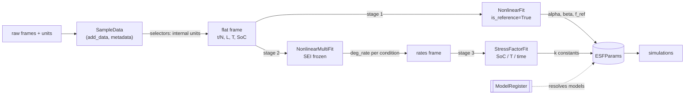

# The fitting subsystem: user flow and architecture

This document explains how fitting works in `esf` — first from the user's
side (what you call, in which order, and what each step consumes and
produces), then from the maintainer's side (how the code is structured and
why). The companion script
[`scripts/examples/full_fitting_workflow.py`](https://github.com/ife-bat/esf/blob/main/scripts/examples/full_fitting_workflow.py)
runs every code fragment shown here end to end on synthetic data; the test
suite executes it, so this document cannot silently drift from the code.

Related documents: the [units convention](reference/units.md); the design
history (decision records DD-*, findings F-*/G-*) lives under
[`development/`](https://github.com/ife-bat/esf/tree/main/development).

---

## 1. The model, briefly

The ESF model (Xu et al., 2018) describes capacity loss `L = 1 − SoH` with a
nonlinear "SEI" envelope wrapped around a *linear* degradation rate:

```
L(x) = 1 − α·exp(−x·β·f) − (1 − α)·exp(−x·f)
```

- `x` is time (calendar regime) or cycle number (cycling regime),
- `α` (`sei_alpha`) is the capacity fraction consumed while the SEI film
  forms, `β` (`sei_beta`) the rate ratio between that phase and the rest of
  life — together they shape the envelope,
- `f` is the linear degradation rate. **Everything condition-dependent lives
  in `f`**, as a product of independent *stress factors*:

```
calendar:  f = S_time(t) · S_SoC(SoC) · S_T(T)
cycling:   f = S_DoD(DoD) · S_SoC(SoC) · S_T(T) [· S_highSoC(SoC)]
```

Each stress factor `S` is a small model function (exponential, linear,
empirical, …) with its own constants (`k_temperature_calendar`,
`k_soc_calendar`, `k_1_dod`, …), normalized so that `S = 1` at the reference
condition (298.15 K, SoC 0.5, …).

This structure dictates the fitting procedure: you cannot fit everything at
once from one data set. Fitting is **staged** — pin the envelope first, then
extract rates, then fit each stress factor from data that varies only that
condition.

## 2. The fitting flow, user's perspective

The complete flow is three stages plus data preparation. All the entry
points are importable from the package top level (`import esf`).

```
aging data ──> SampleData ──> stage 1: SEI fit ──> stage 2: rates fit ──> stage 3: stress-factor fits ──> ESFParams ──> simulation
```

### 2.0 Prepare the data

`SampleData` is the container for aging measurements. You feed it plain
DataFrames plus a `DataType` telling it what the set represents, and the
units the data arrive in. Internally everything is converted to the package
convention (seconds, kelvin, fractions) by the *selectors* on the way out.

```python
import esf

calendar_data = esf.SampleData()
calendar_data.add_data(
    frame,                                          # columns: t, SoH, T, SoC[, subset]
    data_type=esf.DataType.CALENDAR_VS_TEMPERATURE,
    comment="storage test, cell batch 7",
    time_unit="days",                               # what the frame uses
    temperature_unit="K",
)
calendar_data.calculate_life_fraction()             # adds L = 1 - SoH
```

Each `add_data` call becomes one or more *data-sets* (one per `subset`
value), each with its own uid and metadata (units, comment, data type).
Iterating a `SampleData` yields `{"uid", "data", "metadata"}` dicts.

The **selectors** (`calendar_life_vs_temperature`, `calendar_life_vs_soc`,
`cycle_life_vs_temperature`, `cycle_life_vs_dod`, or the generic
`get(data_type)`) return a flat DataFrame with standardized columns
(`t`/`N`, `SoH`, `L`, `T`, `SoC`, …) in internal units — this frame is what
every fit consumes.

### 2.1 Stage one — the SEI fit at reference conditions

Uses only data measured at the reference temperature and SoC, where every
stress factor is 1 and `f` is directly the reference rate. This is the only
stage where `sei_alpha` and `sei_beta` vary.

```python
prms = esf.ESFParams(battery_chemistry="my cell", reference_temperature=298.15)

at_reference = calendar_data.calendar_life_vs_temperature(
    filter_value=298.15, strict_mode=False
)
esf.sei_fit_at_reference_conditions(
    prms, at_reference, data_type=esf.DataType.CALENDAR_VS_TEMPERATURE
)
# prms now holds sei_alpha, sei_beta, deg_per_time_unit
```

The cycling counterpart (`data_type=esf.DataType.CYCLE_VS_TEMPERATURE`, data
with an `N` column) pins `deg_per_cycle` the same way.

Practical notes:

- The data must resolve the SEI *transient* (the first `1/(β·f)` time units)
  as well as the long-term stage, otherwise `α`/`β` are weakly identified.
- `alpha_sei` and `beta_sei` are fitted with physical bounds
  (`α ∈ [0, 1]`, `β ≥ 0`); without them the optimizer can run into overflow
  or park in unphysical optima.

### 2.2 Stage two — one degradation rate per condition

With the envelope frozen, every temperature (or SoC) series is refitted for
its linear rate only:

```python
selection = calendar_data.calendar_life_vs_temperature(strict_mode=False)
rates = esf.degradation_rates_fit(
    prms, selection, data_type=esf.DataType.CALENDAR_VS_TEMPERATURE
)
#    t_max       T  deg_rate
# 2.59e+08  288.15  0.000142      <- one row per condition,
# 2.59e+08  298.15  0.000450         deg_rate in 1/day
# ...
```

The returned frame (`z` column + `deg_rate`) is the input contract for
stage three.

### 2.3 Stage three — stress-factor fits

Each stress-factor fit normalizes the rates by the rate at the reference
condition (`S = f / f_ref`) and fits its model function to the result:

```python
esf.temperature_stress_factor_fit(prms, rates, data_type=esf.DataType.CALENDAR_VS_TEMPERATURE)
esf.soc_stress_factor_fit(prms, rates_vs_soc, data_type=esf.DataType.CALENDAR_VS_SOC)
esf.time_stress_factor_calc(prms, rates, data_type=esf.DataType.CALENDAR_VS_TEMPERATURE)
```

- Temperature and SoC are *fits* (lmfit); time is a *calculation*
  (`k_t = f_ref / t_ref`, valid for the proportional time model).
- The **DoD** fit is a special case (§2.3.1): its data is cycle-life-vs-DoD,
  not a rate, and it is *not* normalized to 1 at a reference DoD.

### 2.3.1 The DoD stress-factor fit

DoD is structurally different from SoC/temperature (the modeling decisions are
summarised in the `DoDSFfit` docstrings and `development/2026-07-13_round4-plan.md`
B1):

- the data is **cycle life `N` to end-of-life vs `DoD`**;
- the DoD model output *is* the per-cycle degradation rate (it carries the
  magnitude, it is not a normalized multiplier), so `deg_per_cycle` is not
  used for cycling simulation when the DoD model is active;
- the fit converts `N` to that rate by the linear inversion
  `S_dod = full_degradation_level / N` (EOL loss = 0.20) and fits the DoD
  model in stress-factor space;
- the model **form follows the chemistry** (`battery_chemistry`): Empirical
  for LMO, Exponential for LFP, Quadratic for NMC (Xu et al. eqs. 32/29/30).
  An explicit `dod_cycling_model` label overrides the chemistry default.

```python
frame = pd.DataFrame({"DoD": dod, "N": cycle_life})   # at reference SoC/T
esf.dod_stress_factor_fit(prms, frame, data_type=esf.DataType.CYCLE_VS_DOD)
# prms now holds k_1_dod, k_2_dod, k_3_dod
```

**Reference vs non-reference.** With `is_at_reference=True` (default) the cycles
are assumed to be at the reference SoC and temperature. With
`is_at_reference=False` the temperature, SoC and calendar-time stress factors
are removed first (Xu et al. eqs. 20/31):
`S_dod = f_d,1 / (S_T·S_soc) − S_t`, with `f_d,1 = full_degradation_level / N`.
This requires the extra per-point columns `T`, `SoC` and `t_cycle`, and the
temperature/SoC/time stages already fitted in `prms` (missing columns raise a
clear `ValueError`).

### 2.4 Results, overrides, verbosity

**Results.** By default the fits write their results into the shared
`ESFParams` object (and `prms.mark_changed()` timestamps it). To *read*
results without the side effect, every fit object exposes
`fitted_parameters()` — a plain dict keyed by `ESFParams` attribute name:

```python
fit = esf.temperature_stress_factor_fit(prms, rates, ...)
fit.fitted_parameters()   # {"k_temperature_calendar": 0.0693, "reference_temperature": 298.15}
```

To suppress the write entirely, pass `apply=False` to any fit facade
(`sei_fit_at_reference_conditions`, `soc`/`temperature`/`dod_stress_factor_fit`,
`time_stress_factor_calc`): the fit runs and its result is readable via
`fitted_parameters()` / `parameter_uncertainty()`, but `prms` is untouched.
`apply=True` (the default) preserves the existing behaviour.

**Overrides.** Initial values, bounds, and fixed parameters of the underlying
lmfit model are controlled with the explicit `parameter_overrides` argument.
Unknown names raise (typos cannot silently vanish):

```python
esf.soc_stress_factor_fit(
    prms, rates_vs_soc, data_type=esf.DataType.CALENDAR_VS_SOC,
    parameter_overrides={
        "k": {"value": 1.0, "vary": True, "min": 0.0, "max": 4.0},  # full spec
        "x_ref__value": 0.5,                                        # one attribute
    },
)
```

**Verbosity.** Fits are silent by default; everything they would say goes to
`logging` at DEBUG level. `verbose=True` prints the fit report and shows the
diagnostic plots. `fit.plot_results()` renders the fit/residual figure at any
time.

### 2.5 Round trip and simulation

`ESFParams` serializes losslessly to JSON (`save_json`/`load_json`,
full float precision, `uncertainties` values and runtime-added custom
parameters included). The fitted set plugs directly into the simulators:

```python
prms.save_json("my_cell.json")
...
prms = esf.ESFParams.load_json("my_cell.json")
result = esf.drive_cycle_degradation_calculator(drive_cycle_frame, prms, cycle_numbers=...)
```

---

## 3. Architecture of the fitting codebase

### 3.1 Module map

| Module | Role | Depends on |
|---|---|---|
| `esf/models/base_models.py` | Pure math: stress-factor relations, nonlinear SEI model. NumPy-vectorized free functions, no state. | numpy |
| `esf/models/register_models.py` | `ModelRegister`/`ModelItem`: the registry mapping `(regime, factor, label)` → model function + parameter names + lmfit defaults. Built once at import (`esf._mr`). | base_models, lmfit |
| `esf/settings/parameters.py` | `ESFParams` (the parameter hub), `DataType`/`Regime`/`Columns` enums, unit constants. | register (lazily), units |
| `esf/settings/units.py` | The single shared pint `UnitRegistry`. | pint |
| `esf/io/data.py` | `SampleData` container + selectors: unit-normalizing bridge from raw frames to fit input. | parameters |
| `esf/models/fitting.py` | The fit classes and the top-level fit functions (orchestration only — no plotting, no raw prints). | all of the above |
| `esf/models/fit_plotting.py` | Rendering of fit results; duck-typed on the fit object, imported only by the thin `plot_results` delegators. | matplotlib |

The dependency direction is strictly downward in this table; plotting is a
leaf. `fitting.py` is the only module that knows about lmfit *and* the data
containers *and* the parameters.

### 3.2 Data flow



`ESFParams` is the hub: fits read model choices and reference values from
it, and write fitted constants back into it. The register is consulted
through `ESFParams`' generic accessors, never directly by the fits.

### 3.3 The registry and the parameter hub

**Registry** (`ModelRegister`): every stress model is registered once, keyed
by `(regime, factor, label)` — e.g. `("Calendar", "soc", "Exponential")` —
with the model function, the *explicit* list of `ESFParams` attribute names
holding its parameters (first entry is the independent variable), and the
lmfit defaults (`get_parameter_dict()` returns a deep copy, so fits can
adjust their copy without corrupting the registry).

**Hub** (`ESFParams`): a flat dataclass of every constant, unit, and model
*label* choice (`soc_calendar_model = "Exponential"`). One generic accessor
family resolves a stress model end to end:

```python
prms.stress_model_label("Calendar", "soc")        # "Exponential"
prms.stress_model_function("Calendar", "soc")     # the callable
prms.stress_model_parameter_values("Calendar", "soc")   # current values
prms.stress_models("Calendar")                    # the active model set
```

This triangle — *registry defines models, ESFParams selects and stores
values, accessors join them* — is the core architectural choice. There is
exactly one path from "which SoC model is active" to "callable + values",
used identically by the fits and the simulators.

### 3.4 The fit class hierarchy

```
BaseProcessor                # data/prms/units/verbosity plumbing, echo(), is_cycling
└── BaseFit                  # lmfit machinery: model creation, _fit, overrides,
    │                        # FitResult, simulate(), plot_results() delegator
    ├── StressFactorFit      # normalization to reference, x_ref unit conversion,
    │   │                    # fitted_parameters()/update_prms via the registry
    │   ├── SoCSFfit         # set_mode: resolves ("Calendar"/"Cycling", "soc")
    │   ├── TemperatureSFfit # set_mode: resolves (..., "temperature")
    │   └── DoDSFfit         # raises NotImplementedError (see §6)
    └── NonlinearFit         # the SEI model; is_reference switches alpha/beta free/frozen
BaseProcessor
└── TimeSFCalc               # a calculation, not a fit (k_t = f_ref / t_ref)
NonlinearMultiFit            # composition: one NonlinearFit per z-group
```

The pattern is **template method**: `BaseFit.fit()` runs the pipeline
(preprocess → build lmfit model → merge overrides → fit → store result →
`update_prms`), and subclasses fill in three hooks:

- `set_mode()` — pick the model from the registry for the fit's regime,
- `default_parameter_dict()` — lmfit defaults when not created from `prms`,
- `preprocess_degradation_rates()` — e.g. the stress-factor normalization
  `S = f / f_ref` (picking the measured point closest to the reference).

`NonlinearMultiFit` is deliberately *not* a `BaseFit`: it is a thin
composer that groups the data by the z-column and runs one `NonlinearFit`
per group, collecting `fit_results` and exposing
`get_parameters_dataframe()` (the stage-2 → stage-3 contract).

**Facade functions.** Users normally call `sei_fit_at_reference_conditions`,
`degradation_rates_fit`, `soc_stress_factor_fit`, … — top-level functions
that construct the right class with the right flags from a `DataType` and
run it. The classes stay available for non-standard flows.

### 3.5 Cross-cutting contracts

- **Units**: internal units everywhere past the selectors (seconds, kelvin,
  fractions). Reference values are converted at exactly one point
  (`StressFactorFit.convert_reference_value`) when a fit is built from
  `prms`. The temperature model is not unit-covariant, so this convention is
  load-bearing — see the units section in the README.
- **Regime vocabulary**: a fit's `regime` is coerced to a `Regime` enum at the
  constructor boundary (`coerce_regime`), so `self.regime` is always the enum
  (decorated strings like `"cycling_vs_temperature"` map to `Regime.CYCLING`).
  Classification is the `is_cycling`/`is_calendar` properties (an `is`
  comparison against the enum) and the module-level `is_cycling_regime`/
  `is_calendar_regime` helpers for the standalone functions — never ad-hoc
  string matching.
- **Results**: `fitted_parameters()` is the pure read side (dict keyed by
  `ESFParams` attribute names); `update_prms()` is the write side and
  consumes the read side. Facade functions currently always write (see §6).
- **Overrides**: `apply_parameter_overrides(..., strict=True)` backs the
  public `parameter_overrides` argument (typos raise); the legacy
  `fit(**kwargs)` path shares the same core with `strict=False`.
- **Silence**: library code prints nothing unless `verbose=True`; `echo()`
  is a logging.debug-plus-verbose-print helper. Plotting never happens
  implicitly except under `verbose=True`.
- **Testing**: every stage has synthetic-data *recovery* tests (generate
  from known constants → fit → recover exactly), and the end-to-end pipeline
  is pinned numerically (`tests/test_fit_recovery.py`,
  `tests/test_example_workflow.py`). This is what makes refactoring the
  internals safe.

### 3.6 How to add a new stress factor

The architecture is built for this; it takes four small steps:

1. **Math** — add the model function to `base_models.py`
   (`my_rate_k_relation(x, k_1, ..., x_ref)`, vectorized, `S(x_ref) = 1`).
2. **Register** — in `register_models.run()`, register it per regime with
   explicit `parameter_names` (the `ESFParams` attribute names) and lmfit
   defaults.
3. **Parameters** — add the constants (`k_..._cycling`, `reference_...`) as
   `ESFParams` fields, plus the label field (`rate_cycling_model = "Linear"`),
   and add the factor to the relevant `MODEL_SETS` entries. Simulation picks
   it up automatically via `prms.stress_models(regime)`.
4. **Fit class** — subclass `StressFactorFit` with a `set_mode()` resolving
   your `(regime, factor)`, plus a facade function; add a recovery test that
   generates synthetic rates from known constants and asserts they come back.

---

## 4. Design rationale (short version)

| Choice | Why |
|---|---|
| Staged fitting instead of one global fit | The model is a product of factors — jointly unidentifiable from mixed data. Staging mirrors how the experiments are designed (one condition varied at a time). |
| Registry + flat `ESFParams` instead of per-model config objects | One serializable artifact holds everything a simulation needs; model *choice* is data (a label), not code. The registry keeps model metadata (parameter names, defaults) out of the fit classes. |
| Template method hierarchy, thin subclasses | The lmfit plumbing is identical for every stress factor; subclasses only differ in which model they resolve and how rates are preprocessed. |
| Facade functions over classes | The standard workflow reads as a script (see §2); classes remain for custom flows and testing. |
| Plotting extracted, duck-typed | Fitting logic has no matplotlib dependency; plots consume fit objects, not vice versa. |
| Recovery tests on synthetic data | The only test style that proves the *numbers* are right, not just that code runs; they caught real bugs (unbounded SEI parameters, registry corruption, unit inconsistencies). |

## 5. Known gaps and direction

- **DoD stress-factor fit** (`DoDSFfit`): the reference-conditions path is
  implemented (§2.3.1) and validated against the published LMO constants; the
  **non-reference** path (stress-factor removal per Xu et al. eqs. 20/31,
  needing DoD data with per-point cycle duration / T / SoC) still raises.
  Chemistry-driven model selection is manual for now — the Empirical (LMO/NMC)
  and Exponential (LFP) forms are registered, but an NMC-specific form and
  automatic selection by `battery_chemistry` are not yet wired.
- **Fits mutate `prms`** *(addressed)*: the read side is `fitted_parameters()`
  and the write is now opt-out — every facade takes `apply=False` to run
  without touching `prms` (default `apply=True` preserves prior behaviour).
- **Regime as enum end to end** *(done)*: `regime` is coerced to a `Regime`
  enum at the fit constructor (`coerce_regime`); `self.regime` is always the
  enum, and `is_cycling`/`is_calendar` are `is` comparisons against it.
- **Uncertainty propagation**: `ESFParams` can hold `uncertainties` values
  and lmfit reports parameter errors, but the pipeline converts to floats;
  propagating errors through simulation is future work.
